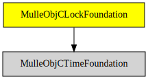

# MulleObjCLockFoundation

#### 🔐 MulleObjCLockFoundation provides locking support

This framework builds on `mulle-thread` but is also dependend on posix
conditions.


| Release Version                                       | Release Notes
|-------------------------------------------------------|--------------
|  [](//github.com/MulleFoundation/MulleObjCLockFoundation/actions) | [RELEASENOTES](RELEASENOTES.md) |


## API

### Classes

| Class             | Description
|-------------------|-----------------------
| `NSLock`          |
| `NSCondition`     |
| `NSConditionLock` |
| `NSRecursiveLock` |


### Protocols

| Class             | Description
|-------------------|-----------------------
| `NSLocking`       |


## Requirements

|   Requirement         | Release Version  | Description
|-----------------------|------------------|---------------
| [MulleObjCTimeFoundation](https://github.com/MulleFoundation/MulleObjCTimeFoundation) |  [](https://github.com/MulleFoundation/MulleObjCTimeFoundation/actions/workflows/mulle-sde-ci.yml) | 💰 MulleObjCTimeFoundation provides time classes
| [mulle-objc-list](https://github.com/mulle-objc/mulle-objc-list) |  [](https://github.com/mulle-objc/mulle-objc-list/actions/workflows/mulle-sde-ci.yml) | 📒 Lists mulle-objc runtime information contained in executables.

### You are here



## Add

Use [mulle-sde](//github.com/mulle-sde) to add MulleObjCLockFoundation to your project:

``` sh
mulle-sde add github:MulleFoundation/MulleObjCLockFoundation
```

## Install

### Install with mulle-sde

Use [mulle-sde](//github.com/mulle-sde) to build and install MulleObjCLockFoundation and all dependencies:

``` sh
mulle-sde install --prefix /usr/local \
   https://github.com/MulleFoundation/MulleObjCLockFoundation/archive/latest.tar.gz
```

### Manual Installation

Install the requirements:

| Requirements                                 | Description
|----------------------------------------------|-----------------------
| [MulleObjCTimeFoundation](https://github.com/MulleFoundation/MulleObjCTimeFoundation)             | 💰 MulleObjCTimeFoundation provides time classes
| [mulle-objc-list](https://github.com/mulle-objc/mulle-objc-list)             | 📒 Lists mulle-objc runtime information contained in executables.

Download the latest [tar](https://github.com/MulleFoundation/MulleObjCLockFoundation/archive/refs/tags/latest.tar.gz) or [zip](https://github.com/MulleFoundation/MulleObjCLockFoundation/archive/refs/tags/latest.zip) archive and unpack it.

Install **MulleObjCLockFoundation** into `/usr/local` with [cmake](https://cmake.org):

``` sh
cmake -B build \
      -DCMAKE_INSTALL_PREFIX=/usr/local \
      -DCMAKE_PREFIX_PATH=/usr/local \
      -DCMAKE_BUILD_TYPE=Release &&
cmake --build build --config Release &&
cmake --install build --config Release
```

## Author

[Nat!](https://mulle-kybernetik.com/weblog) for Mulle kybernetiK  


